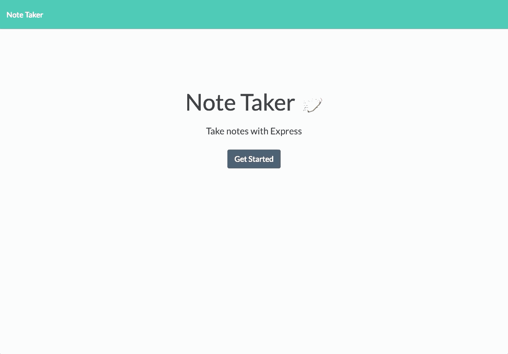

# Note Taker

## Contents
* [Description](#description)
* [site](#site)
* [Installation](#installation)
* [Usage](#usage)
* [References](#references)
* [Shoutouts](#shoutouts)
* [License](#license)
* [Contact](#contact)

## Description

Web app that saves notes to the server database. User can save notes, then view or delete those notes, or write another.
### [site](https://rocky-falls-96529.herokuapp.com/)

## Installation
`npm install`

## Usage
run using node:\
`npm run start`\
run using nodemon:\
`npm run watch`

## References
[file pathing](https://stackoverflow.com/questions/31504798/using-express-js-to-serve-html-file-along-with-scripts-css-and-images/31505061)\
[push to array in other file](https://stackoverflow.com/questions/61473968/how-to-push-object-inside-an-array-while-writing-to-a-file-in-node-js)

## Shoutouts
Thanks so much to [Bing](https://github.com/imbingz) for helping me with the array filter

## License
This application covered under the MIT license

## Contact
Github: [theykay](https://github.com/theykay)\
Email: [murraykyleb@gmail.com](mailto:murraykyleb@gmail.com)